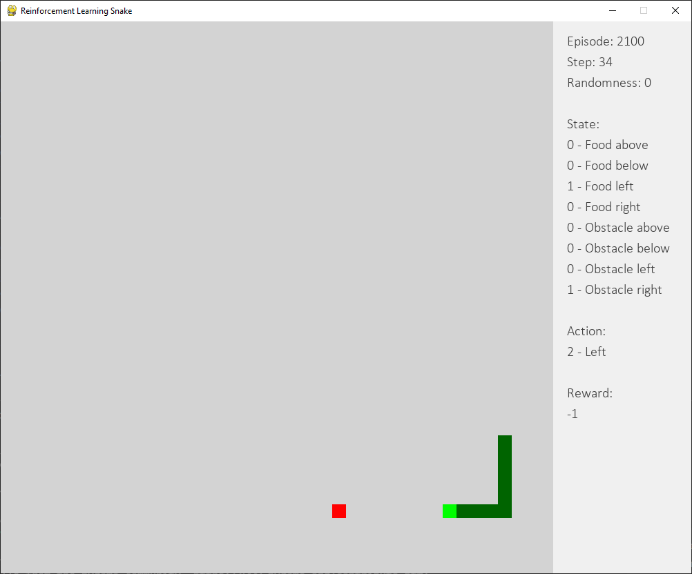

# rl-snake | Reinforcement Learning Snake

This code demonstrates Q learning using a reinforcement learning snake.

Our objective is for the snake to eat the fruit although it is completely unaware of this aim.

The snake has access to the following state information:

- Food above
- Food below
- Food left
- Food right
- Obstacle above
- Obstacle below
- Obstacle left
- Obstacle right

...and can move up, down, left or right.  Each move results in one of the following rewards:

- Hits body: -100 (bad)
- Hits wall: -100 (bad)
- Moves further from fruit: -10 (bad but not as bad as crashing) 
- Moves nearer to fruit: -1 (good)
- Eats fruit: 0 (great)

The balance between environment exploration and exploitation is controlled with an epsilon value.  Epsilon starts at 1 (random exploration, with results being fed into the Q table) and gradually reduces to zero (Q table exploitation only).